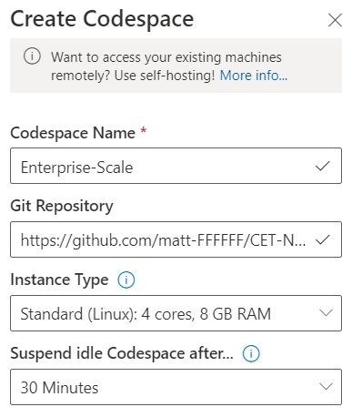

# Devcontainer and Visual Studio Code Spaces

The two files in this directory make it simple to satisfy all the dependencies for working with the GitOps process.
Using Docker, we can ensure a consistent development environment for all.

Can be used in two ways:

1. Online, using Visual Studio Code Spaces
2. Locally, using Docker

Instructions for both are below:

## Pre-Requisites

1. You have forked the CET-NorthStar repo in GitHub

## Visual Studio Code Spaces

1. You must make sure you have registered the VSOnline provider in you Azure subscription. Use Cloud Shell to run either of the following commands in bash or PowerShell:

   ### az cli

   ```azcli
   az provider register --namespace Microsoft.VSOnline
   ```

   ### PowerShell

   ```PowerShell
   Register-AzResourceProvider -ProviderNamespace Microsoft.VSOnline
   ```

2. Navigate to <https://online.visualstudio.com/environments>.
   If you haven't already created a plan then you will be prompted to do so.
   Select your region and resource group name.

3. Click 'Create Codespace' and enter details, including the URL of your GitHub repo

   

4. The Code Space will be created using the Dockerfile in this directory

5. You can then connect to this Code Space using your browser, or VS Code using the Code Spaces extension ```ms-vsonline.vsonline```

> Note, to use Jupyter notebooks you will need to use VS Code. We need to forward the Jupyter notebook HTTP server port to the local machine. This does not work in-browser (even though it looks like it's going to).

## Local Docker (Windows)

1. Install VS Code and Docker Desktop (preferably using WSL2 - the detail of which is outside the scope of this document)
2. Install the VS Code Remote Containers extension: ```ms-vscode-remote.remote-containers```
3. Clone the Enterprise Scale repo locally
4. Open in VS Code, you should be prompted to open in a dev container. If not, you can press ```CTRL+SHIFT+P``` and type ```remote-containers```. Select the Open Workspace in a Container option
